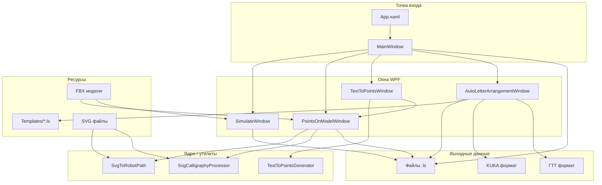
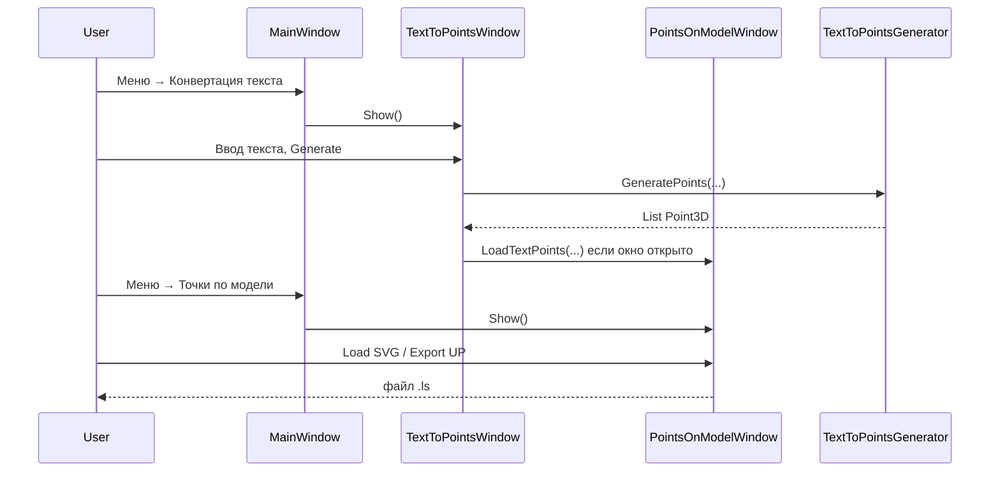

# Fanuc Programmer

Desktop-приложение на WPF (.NET Framework 4.7.2) для подготовки, визуализации и экспорта управляющих программ (УП) роботов **Fanuc** в формате `.ls`. Поддерживает ручной ввод точек, симуляцию траектории, генерацию текста и SVG, размещение объектов на листе A4 и экспорт в нескольких форматах (Fanuc, KUKA, ГТТ).

---

## Содержание

- [Назначение](#назначение)
- [Технологии](#технологии)
- [Архитектура](#архитектура)
- [Модули приложения](#модули-приложения)
- [Ядро обработки данных](#ядро-обработки-данных)
- [Формат Fanuc LS](#формат-fanuc-ls)
- [Структура проекта](#структура-проекта)
- [Сборка и запуск](#сборка-и-запуск)
- [Зависимости](#зависимости)
- [Потоки данных между окнами](#потоки-данных-между-окнами)
- [Соглашения и ограничения](#соглашения-и-ограничения)

---

## Назначение

Приложение решает задачи полного цикла подготовки программы для робота-манипулятора:

1. **Создать** программу из таблицы точек (Cartesian XYZ или Joint J1–J6).
2. **Сгенерировать** траекторию из SVG, текста или библиотеки букв.
3. **Визуализировать** траекторию и 3D-модели в рабочей зоне.
4. **Экспортировать** готовый `.ls` файл для загрузки на контроллер Fanuc.

---

## Технологии

| Компонент | Технология |
|-----------|------------|
| UI | WPF (XAML + code-behind) |
| Платформа | .NET Framework 4.7.2 |
| 3D | WPF `Viewport3D`, `Media3D` |
| FBX / 3D | AssimpNet 4.1 |
| SVG | SharpVectors 1.8, Svg 3.4 |
| Текст / шрифты | System.Drawing (GDI+) |
| Word | DocumentFormat.OpenXml |
| Тесты | MSTest (инфраструктура в csproj) |

---

## Архитектура

Приложение построено как **один исполняемый проект** с несколькими независимыми окнами. Общая бизнес-логика вынесена в статические классы-утилиты; окна содержат UI, 3D-сцену и экспорт.



### Слои

| Слой | Ответственность | Файлы |
|------|-----------------|-------|
| **Presentation** | Окна, меню, 3D-viewport, панели управления | `*Window.xaml(.cs)`, `MainWindow.*` |
| **Domain / Processing** | Конвертация SVG, текста, каллиграфии в `Point3D` | `SvgToRobotPath`, `SvgCalligraphyProcessor`, `TextToPointsGenerator` |
| **Scene / Visualization** | 3D-сцена, трансформации, объекты | `PointsOnModelWindow`, `SimulateWindow`, класс `Sphere` |
| **Export** | Генерация `.ls`, расчёт PROG_SIZE / MEMORY_SIZE | `MainWindow`, `PointsOnModelWindow`, `AutoLetterArrangementWindow` |
| **Templates** | Библиотека траекторий букв | `bin/.../Templates/*.ls` |

### Паттерны

- **Code-behind** — каждое окно = один partial class; MVVM не используется.
- **Static helpers** — парсинг SVG и генерация текста без DI/IoC.
- **SceneObject** (в `PointsOnModelWindow`) — единая модель объектов сцены (модель, SVG, текст, каллиграфия).
- **Межоконная связь** — через `Application.Current.Windows.OfType<T>()` (например, `TextToPointsWindow` → `PointsOnModelWindow`).

---

## Модули приложения

### 1. MainWindow — редактор УП

**Файлы:** `MainWindow.xaml`, `MainWindow.xaml.cs`

Главное окно и точка входа (`StartupUri="MainWindow.xaml"`).

**Функции:**
- Ввод количества точек, режим **XYZ** (Cartesian) или **J** (Joint).
- Таблицы координат (`PointData`, `JointData`) и имён точек (`PointNameData`).
- Генерация заголовка Fanuc LS (`/PROG`, `/ATTR`, `/MN`, `/POS`, `/END`).
- Расчёт `PROG_SIZE` и `MEMORY_SIZE`: `423 + 61×N` и `795 + 57×N`.
- Сохранение в `.ls` (кодировка ASCII).
- Меню **«Симуляция»** — открытие остальных окон.

---

### 2. SimulateWindow — симуляция траектории

**Файлы:** `SimulateWindow.xaml`, `SimulateWindow.xaml.cs`

3D-визуализация загруженной программы и моделей.

**Функции:**
- Загрузка `.ls`, извлечение координат из секции `/POS`.
- Отображение точек, линий траектории, нумерации.
- Рабочая зона ±100×100×100 мм, оси, нулевая плоскость.
- Загрузка FBX через Assimp (общая логика с PointsOnModel).
- Управление камерой: мышь, слайдеры, WASD, стрелки.
- Класс **`Sphere`** — примитив для отображения точек (используется и в других окнах).

---

### 3. PointsOnModelWindow — точки по модели

**Файлы:** `PointsOnModelWindow.xaml`, `PointsOnModelWindow.xaml.cs`

Центральный модуль для компоновки задания на листе A4.

**Функции:**
- 3D-сцена: лист A4, сетка 7×10, нумерованные ячейки (1–70).
- Загрузка FBX, SVG, текстовых точек; объекты типа `SceneObject`.
- `SceneObjectManager` — выбор, добавление, удаление объектов.
- Единый конвейер трансформаций (`BuildObjectTransformGroup`, `TransformSheetLocalPoint`, `WorldToSheetLocal`).
- Каллиграфический режим SVG с подъёмами кисти и параметром R.
- Экспорт УП для объектов SVG/Calligraphy.

Подробнее: [README_PointsOnModel.md](FanucProgrammer/README_PointsOnModel.md)

**Типы объектов (`SceneObjectType`):**

| Тип | Источник | Экспорт в УП |
|-----|----------|--------------|
| `Model3D` | FBX | Нет (только визуализация) |
| `SVG` | SVG файл | Да |
| `Calligraphy` | SVG + каллиграфия | Да |
| `Text` | TextToPointsWindow | Через объекты сцены |

---

### 4. TextToPointsWindow — текст в точки

**Файлы:** `TextToPointsWindow.xaml`, `TextToPointsWindow.xaml.cs`

**Функции:**
- Ввод текста вручную или из **Word (.docx)** через OpenXML.
- Выбор шрифта (системные + пользовательские `.ttf`/`.otf`).
- Режимы: обводка контуром / центральная линия.
- Параметры: размер, шаг точек, глубина Z, подъём, раздельные символы.
- Генерация через `TextToPointsGenerator`.
- Передача результата в открытое окно `PointsOnModelWindow` (`LoadTextPoints`).

---

### 5. AutoLetterArrangementWindow — генератор текста из букв

**Файлы:** `AutoLetterArrangementWindow.xaml`, `AutoLetterArrangementWindow.xaml.cs`

**Функции:**
- Библиотека букв из шаблонов `Templates/*.ls` (латиница A–Z, кириллица).
- `ParseLsFile` — извлечение точек P[n] из секции `/POS`.
- `GenerateWordPoints` — сборка слова/фразы с интервалами и масштабом.
- 2D-превью на Canvas (лист A4).
- Экспорт:
  - **Fanuc LS** (стандартный)
  - **KUKA**
  - **ГТТ** (специальный формат Fanuc)

Шаблоны ищутся в `{BaseDirectory}/Templates/`.

---

## Ядро обработки данных

### SvgToRobotPath

```text
SVG файл → SharpVectors FileSvgReader → Path geometry
         → дискретизация с шагом stepMm → List<Point3D>
```

Плоский контур без подъёмов; используется для обычного SVG-режима.

### SvgCalligraphyProcessor

```text
SVG → режим (SingleStroke | OutlineFill | BrushStroke)
    → List<CalligraphyStroke> с флагами IsLiftMovement, IsNewCharacter
    → переменная ширина штриха → параметр R робота
```

Используется в `PointsOnModelWindow` для каллиграфии и экспорта с подъёмами Z.

### TextToPointsGenerator

```text
Текст + Font (GDI+) → Bitmap / GraphicsPath
                    → Contour или CenterLine (скелетизация)
                    → List<Point3D> с lift-сегментами
```

Не использует SVG как промежуточный формат; работает напрямую с `System.Drawing`.

---

## Формат Fanuc LS

Типичная структура генерируемого файла:

```text
/PROG  PROGRAM
/ATTR
OWNER       = MNEDITOR;
COMMENT     = "...";
PROG_SIZE   = ...;
LINE_COUNT  = ...;
MEMORY_SIZE = ...;
...
/MN
   1:L P[1] 250mm/sec CNT60    ;
   2:L P[2] 250mm/sec CNT60    ;
/POS
P[1]{
   GP1:
    UF : 9, UT : 9,  CONFIG : 'N U T, 0, 0, 0',
    X =   ... mm,  Y =   ... mm,  Z =    ... mm,
    W =  -180.000 deg,  P =       .000 deg,  R =    ... deg
};
/END
```

**Расчёт размеров** (используется в MainWindow, PointsOnModel, AutoLetter):

| Поле | Формула |
|------|---------|
| `PROG_SIZE` | `423 + 61 × количество_точек` |
| `MEMORY_SIZE` | `795 + 57 × количество_точек` |
| `LINE_COUNT` | число строк движения в `/MN` |

Имя программы ограничено **8 символами** (A–Z, 0–9, `_`).

---

## Структура проекта

```text
FanucProgrammer/
├── README.md                          ← этот файл
├── FanucProgrammer/
│   ├── FanucProgrammer.sln
│   ├── README_PointsOnModel.md        ← детали модуля «Точки по модели»
│   ├── packages/                      ← NuGet-пакеты
│   └── FanucProgrammer/
│       ├── App.xaml                   ← StartupUri → MainWindow
│       ├── MainWindow.xaml(.cs)       ← главное окно, генератор LS
│       ├── SimulateWindow.xaml(.cs)   ← 3D-симуляция
│       ├── PointsOnModelWindow.xaml(.cs)
│       ├── TextToPointsWindow.xaml(.cs)
│       ├── AutoLetterArrangementWindow.xaml(.cs)
│       ├── SvgToRobotPath.cs          ← SVG → точки
│       ├── SvgCalligraphyProcessor.cs ← SVG → штрихи каллиграфии
│       ├── TextToPointsGenerator.cs   ← текст → точки
│       ├── Properties/
│       ├── bin/Debug/
│       │   ├── FanucProgrammer.exe
│       │   └── Templates/             ← шаблоны букв *.ls (runtime)
│       └── FanucProgrammer.csproj
```

### Модели данных (основные)

| Класс | Расположение | Назначение |
|-------|--------------|------------|
| `PointData`, `JointData`, `PointNameData` | MainWindow.xaml.cs | Таблица точек УП |
| `SceneObject`, `SheetTransform`, `GridCell` | PointsOnModelWindow | Объекты 3D-сцены |
| `CalligraphyStroke`, `CalligraphyMode` | SvgCalligraphyProcessor | Штрихи SVG |
| `LetterTemplate`, `ProgramPoint` | AutoLetterArrangementWindow | Буквы и экспорт |
| `Sphere` | SimulateWindow.xaml.cs | 3D-сфера для точек |

---

## Сборка и запуск

### Требования

- Windows 10+
- Visual Studio 2019+ (или Build Tools) с поддержкой .NET Framework 4.7.2
- NuGet Package Restore

### Команды

```powershell
cd FanucProgrammer
nuget restore FanucProgrammer.sln
msbuild FanucProgrammer.sln /p:Configuration=Debug
```

Запуск: `FanucProgrammer\FanucProgrammer\bin\Debug\FanucProgrammer.exe`

### Шаблоны букв

Для **AutoLetterArrangementWindow** папка `Templates` с файлами `.ls` (по одному на букву) должна находиться рядом с `.exe`. При сборке убедитесь, что шаблоны копируются в выходную директорию (сейчас они присутствуют в `bin/Debug/Templates/`).

---

## Зависимости

| Пакет | Назначение |
|-------|------------|
| **AssimpNet** | Импорт FBX и других 3D-форматов |
| **SharpVectors** | Парсинг и рендер SVG в WPF |
| **Svg** | Дополнительная работа с SVG |
| **DocumentFormat.OpenXml** | Чтение `.docx` |
| **Extended.Wpf.Toolkit** | Расширенные WPF-контролы |
| **MSTest.*** | Тестовая инфраструктура (dev) |

Полный список: `FanucProgrammer/FanucProgrammer/packages.config`

---

## Потоки данных между окнами



**Рекомендуемый порядок для текста:** сначала открыть «Точки по модели», затем «Конвертация текста» — иначе точки останутся только в сообщении без 3D-отображения.

---

## Соглашения и ограничения

### Система координат

- Рабочая зона симуляции: **±100 мм** по X/Y, **0–100 мм** по Z.
- Лист A4 в PointsOnModel: локальные координаты с коррекцией **−90°** по оси Z для согласования с роботом (`COORDINATE_CORRECTION_ANGLE`).
- Объекты на сетке хранят **локальные** координаты листа; мировые вычисляются через `BuildObjectTransformGroup`.

### Кодировка и локаль

- Экспорт `.ls` — **ASCII**.
- Числа в файлах — **InvariantCulture** (`0.000`).

### Известные особенности

- Legacy-путь `LoadSvgWithCurrentParameters` в PointsOnModel (отображение в `svgPointsGroup` без SceneObject) сохранён для обратной совместимости; для экспорта УП используйте объекты сцены.
- `SimulateWindow` и `PointsOnModelWindow` дублируют часть 3D-логики (камера, Assimp, рабочая зона) — общий класс сцены пока не выделен.
- Legacy WinForms-файлы (`Simulate.cs`, `Form1.Designer.cs`, `Program.cs`) присутствуют в репозитории, но не включены в `.csproj`.

---

## Лицензия и авторство

Проект предназначен для внутреннего использования при программировании роботов Fanuc. При распространении учитывайте лицензии NuGet-зависимостей (AssimpNet, SharpVectors, OpenXML и др.).
